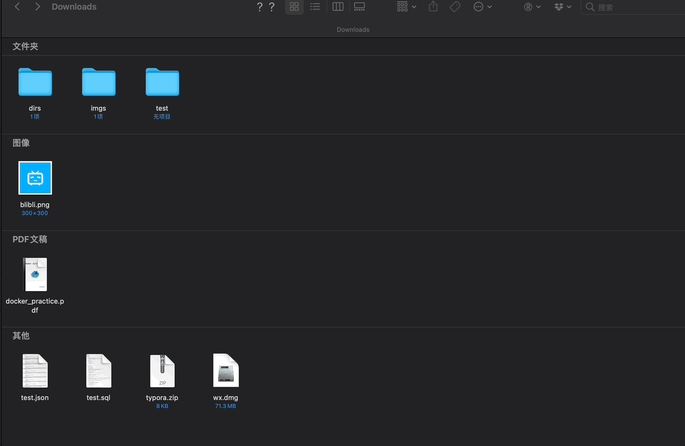

# 文件夹定时自动归档工具





## 主要模块

| 模块        | 作用                           |
| ----------- | ------------------------------ |
| shutil      | 移动文件                       |
| apscheduler | 定时任务                       |
| os          | 获取文件路径，拼接路径，重命名 |
| Datetime    | 获取当前时间                   |
| logging     | 记录运行情况                   |

## 文件结构

```shell
├── README.md
├── config
│   ├── __init__.py			 # 设置配置文件
│   └── auto_archive.conf    # 配置文件
├── log
│   └── auto_archive.log
├── media
│   └── auto_archive.gif
└── src
    └── auto_archive.py		# 主文件
```

## 配置文件说明

```
[root_path]
root_path = /Users/knight/Downloads  # 待归档文件夹

[dir]	# 文件夹
archive_path = /Users/knight/Downloads/dirs  # 文件夹归档后存放路径

[others] # 其他类型文件
archive_path = /Users/knight/Downloads/others  # 其他类型文件归档后存放路径

[img]	# 图片
format = bmp,jpg,jpeg,png,tif,gif,svg,psd,cdr,raw,webp	# 图片文件格式
archive_path = /Users/knight/Downloads/imgs  # 归档后路径

[compress]	# 压缩文件
format = zip,rar,gz,xz,bz2,tar	# 压缩文件格式
archive_path = /Users/knight/Downloads/compress	 # 归档后路径

[dmg]  # dmg
format = dmg  # dmg文件格式
archive_path = /Users/knight/Downloads/dmgs  # 归档后路径

[text]	# 文档
format = docx,doc,pptx,xlsx,xls,pdf,md,txt	# 文档文件格式
archive_path = /Users/knight/Downloads/texts  # 归档后路径
```

## 使用

```
1. git clone git@github.com:FomalHauts/Dir-Auto-Archive.git
2. cd Dir-Auto-Archive
3. pip install -r requirements.txt
3. modify auto_archive.conf as you need
4. cd src
5. python auto_archive.py
```

若新增归档文件类型，则在auto_archive.conf中，新增一个section(section name可以任取,下文示例为sql),无需修改代码，例如：新增一个sql分类

```
[sql]													# section name: sql
format = sql											# sql文件格式
archive_path = /Users/knight/Downloads/sqls	# 归档后路径
```

## 原理

### 归档

1. 根据conf文件判断归档后的文件夹路径是否存在，若不存在，则新建文件夹

2. 根据conf文件获取文档格式与归档路径，存放在字典archive_pairs中，形如：

   {'bmp,jpg,jpeg,png,tif,gif,svg,psd,cdr,raw,webp': '/Users/knight/Downloads/imgs'}

3. 遍历待归档文件夹内所有文件，首先判断其是否为文件夹，若为:

   - 文件夹

     判断文件夹是否为设置的归档文件夹，若不是，则将其归档

   - 文件

     判断该文件是否出现在conf文件中设置的format中,若不在将其移至others文件夹，若在，则将其归档至对应归档文件夹

### 定时任务

定时任务采用apscheduler，定时任务具体设置如下:

```python
def my_listener(event):
    if event.exception:
        logging.error('auto archive failed!!!')
    else:
        logging.info('auto archive success...')

if __name__ == '__main__':
    scheduler = BlockingScheduler()	 # 实例化
    auto_archiver = auto_archive()
    auto_archiver.launch()
    # 添加定时任务:周一至周五每天早上十点执行一次
    scheduler.add_job(func=auto_archiver.launch, trigger='cron', day_of_week='mon-fri', hour=10, minute=0, id='cron_task')

    # 配置任务执行完成和执行错误的监听
    scheduler.add_listener(my_listener, EVENT_JOB_EXECUTED | EVENT_JOB_ERROR)

    # 设置日志
    scheduler._logger = logging

    scheduler.start()
```

### 注意⚠️

若待归档的文件已经在归档文件夹中存在，则将文件(夹)加了当前时间，以与原文件进行区分

**文件夹直接在末尾加时间，如: test_2021-08-11-12-10-20**

**文件在后缀名前加时间，如: test_2021-08-11-12-10-20.jpg**


 


